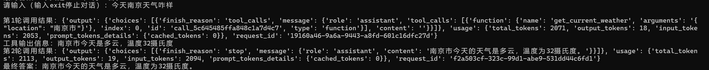
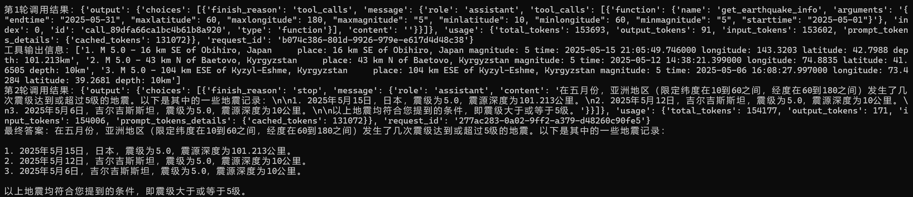
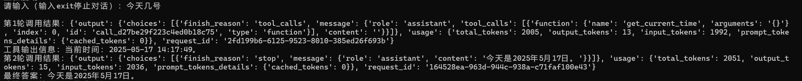
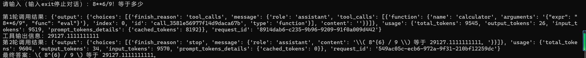
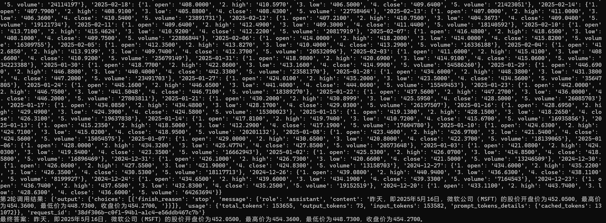

# 智能助手课程设计报告

## 一、选题描述

本项目旨在实现一个基于 Python 的多功能智能助手系统。系统集成了天气查询、地震信息检索、电影信息查询、股票数据获取、数学表达式计算等多种工具，并通过大模型 API 实现自然语言对话与工具自动调用。用户可通过命令行与助手交互，体验智能问答与自动化工具服务。

## 二、方案设计

系统采用模块化设计，主要分为：
- 工具函数模块：实现各类数据查询与计算功能。
- 工具注册与描述模块：用统一格式描述所有可用工具，便于模型调用。
- 对话管理模块：负责与用户交互、消息流转、工具调用与结果返回。
- 大模型 API 接口模块：负责与外部大模型服务通信，实现自然语言理解与工具调用决策。

整体流程如下：
1. 用户输入自然语言问题。
2. 系统将问题与历史消息一同发送给大模型。
3. 大模型判断是否需要调用工具，并返回调用指令。
4. 系统解析指令，调用相应工具函数，获取结果。
5. 将工具结果反馈给大模型，生成最终回复。
6. 向用户展示答案。

## 三、代码模块功能划分与描述

### 1. 工具函数模块
- **get_current_time**：获取当前系统时间。
- **get_current_weather**：调用天气 API 查询指定城市天气。
- **get_earthquake_info**：调用地震数据 API，按条件检索地震事件。
- **get_movie_info**：本地检索电影信息及评论。
- **calculator**：基于 sympy 实现数学表达式求值与方程求解。
- **get_stock_info_intraday/daily/weekly**：调用股票数据 API 获取不同粒度的股票行情。

### 2. 工具注册与描述模块
- 采用 JSON Schema 风格统一描述所有工具的名称、功能、参数类型与必填项，便于大模型自动解析和调用。

### 3. 对话管理模块
- 负责维护消息历史，接收用户输入，管理与大模型的多轮交互。
- 解析大模型返回的工具调用指令，自动执行相应函数，并将结果反馈给模型。

### 4. 大模型 API 接口模块
- 封装与大模型服务的 HTTP 通信，支持消息、工具描述、参数等内容的打包与解析。

## 四、实现效果

### 1. 天气查询功能演示

### 2. 地震信息检索演示

### 3. 电影信息查询演示

### 4. 日期查询功能演示

### 5. 数学计算功能演示

### 6. 股票数据查询演示

> 注：如需查看完整演示图片，请打开 `演示图片/` 文件夹。

## 五、总结

本项目实现了多工具集成的智能助手，具备较强的扩展性和实用性。通过大模型 API 实现了自然语言驱动的自动工具调用，极大提升了用户体验。系统结构清晰，便于后续功能扩展和维护。

---

